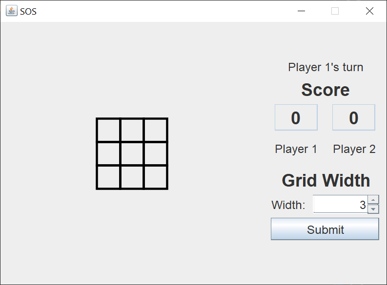
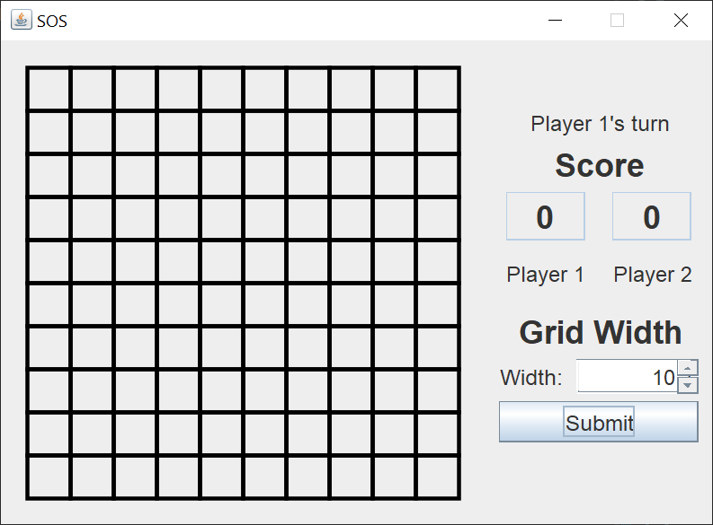
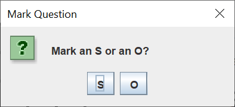
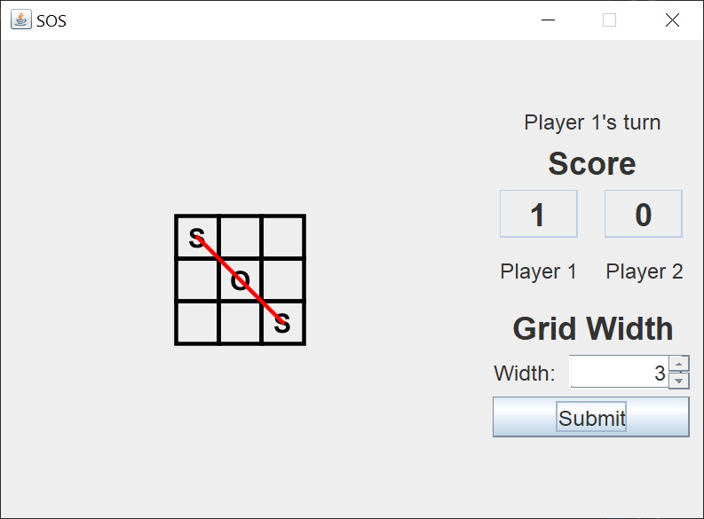
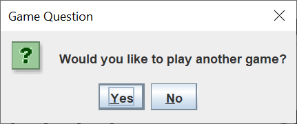

# SOS

## Introduction

[SOS](https://en.wikipedia.org/wiki/SOS_(game)) is a game for two or more players.  Before play begins, a square grid of at least 3x3 squares in size is drawn.  Players take turns to add either an "S" or an "O" to any square, with no requirement to use the same letter each turn. The object of the game is for each player to attempt to create the straight sequence S-O-S among connected squares (either diagonally, horizontally, or vertically), and to create as many such sequences as they can. If a player succeeds in creating an SOS, that player immediately takes another turn, and continues to do so until no SOS can be created on their turn. Otherwise turns alternate between players after each move.

My Java Swing version of SOS was designed for two players.  The grid can be any size between 3x3 and 10x10.  Here's what the GUI looks like when the game starts.

The GUI is a tiny 542x397 pixels.  It should fit on any modern monitor screen.

Here's the GUI when using the full 10x10 grid.

To place an S or an O, the player left-clicks on the square.  The following dialog asks the player if he wants to mark an S or an O.

Here's the GUI after player 1 gets an SOS.

After the grid is filled, the following dialog asks if the players want to play another game.

## Explanation

Oracle has a helpful tutorial, [Creating a GUI With Swing](https://docs.oracle.com/javase/tutorial/uiswing/index.html).  Skip the Learning Swing with the NetBeans IDE section.

I coded this Swing application in tiny, testable pieces.  More often than not, I'd make a syntax or logic error in the 10 lines or so I just added to the code.  Because I test after writing 10 lines of code, the error is probably in those 10 lines, and I can find the mistake fairly easily.

When I create a Swing GUI, I use the [model-view-controller](https://en.wikipedia.org/wiki/Model%E2%80%93view%E2%80%93controller) (MVC) pattern.  This pattern helps me to separate my concerns and focus on one small part of the Swing application at a time.

The MVC name implies that you create the model first, then the view, and finally the controller.  This is an iterative process.  My first ideas for the application model turned out to not work in practice, so I made changes to the model.

A Swing model consists of one or more plain Java getter/setter classes.

A Swing view consists of one `JFrame` and one or more `JPanels`.

A Swing controller consists of one or more actions and/or listeners.

A Swing application implements the MVC pattern in the following manner:

- The view reads information from the model.
- The view does not update the model.
- The controller updates the model and revalidates/repaints the view.

The controller is usually not one single class.  In Swing, each action or listener modifies its part of the model and its part of the view.

### Model

I wrote three model classes for this Swing application.

The `SOSModel` class is a plain Java getter/setter class that holds a logical model of the game grid (`char[][]`), two `int` scores, the `int` width of the grid in cells, from 3 to 10, the `int` player turn indicator, and a `java.util.List` of line segments.

The `LineSegment` class is a plain Java getter/setter class that holds a line `Color`, a start coordinate, and an end coordinate.

The `Coordinate` class is a plain Java getter/setter class that holds an `int` row number and an `int` column number.

### View

The view consists of a `JFrame`, a control `JPanel`, a drawing `JPanel`, and two `JOptionPanes`.

All Swing applications must start with a call to the `SwingUtilities` `invokeLater` method.  This method ensures that all Swing components are created and executed on the [Event Dispatch Thread](https://docs.oracle.com/javase/tutorial/uiswing/concurrency/dispatch.html). 

The `JFrame` has a default `BorderLayout`.  I placed the drawing `JPanel` in the center and the control `JPanel` in the east.

The drawing `JPanel` draws the grid, the S and O moves, and the lines.

The control `JPanel` uses subordinate `JPanels` to create the score area and the grid width area.

### Controller

The controller consists of a `MouseListener` and a lambda expression.

The `GameboardListener` class extends a `MouseAdapter` and implements the logic to place an S or O in the appropriate grid square, checks to see if an SOS is created, and determines whether or not the game is over (the grid is filled).

The lambda expression gets the grid width in cells from the `JSpinner` and updates the model and the view.
